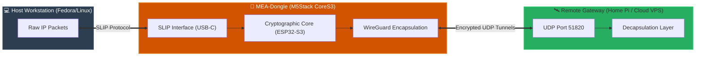

# MEA-Dongle 🔐⚡ (M5Stack CoreS3 Edition)

An open-source, hardware-isolated secure gateway and portable cryptographic network tunneling device natively engineered for the **M5Stack CoreS3** development kit. 

`MEA-Dongle` acts as a zero-trust physical bridge between your workstation and untrusted infrastructure. By establishing a hardware-level **WireGuard VPN** tunnel directly on the dual-core ESP32-S3 processor, it encapsulates all upstream network traffic and routes it to your secure remote gateway using **SLIP (Serial Line Internet Protocol)** over USB-C—keeping your cryptographic keys entirely invisible to the host operating system.

---

## 🛠️ System Mappings & Hardware Architecture

Unlike standard software-based VPN clients, `MEA-Dongle` handles all cryptographic handshakes, key rotation, and packet encapsulation on an isolated hardware domain.

🛰️ Native M5Stack CoreS3 Optimizations

   AXP2101 Power Management Integration: Custom-tuned PMU registers prevent brownout loops and ensure voltage stability during intensive Wi-Fi TX/RX bursts and cryptographic calculation peaks.

   GC0308 Camera System Safeguard (Future Expansion): Low-level hardware hook available for optical air-gapped configuration deployment via QR code parsing.

   On-Device TFT Diagnostic Dashboard: The CoreS3 touchscreen renders a dedicated real-time security UI tracking payload throughput, Wi-Fi RSSI metrics, active handshake logs, and NTP clock status.

🚀 Key Technical Features

   Hardware-Isolated Encryption: Offloads heavy Curve25519 and ChaCha20-Poly1305 operations to the Xtensa LX7 processor, preventing host-level memory-dump attacks from stealing your private keys.

   Low-Overhead Point-to-Point Bridge: Employs a high-speed SLIP layer over a custom baud rate configuration (optimized for 115200/921600 bps), minimizing network stack overhead on the embedded system.

   Persistent Handshake Keepalive: Hardcoded keepalive intervals maintain stable stateful firewall traversal even during prolonged periods of network silence.

⚙️ Firmware Configuration & Build Rules
1. Development Environment Setup

To flash the firmware, use Arduino IDE (v2.x+) or VS Code + PlatformIO.

Preferences -> [https://bdfd.github.io/arduino-boards/package_m5stack_index.json](https://bdfd.github.io/arduino-boards/package_m5stack_index.json)

Install the latest esp32 board library package by Espressif and make sure the M5CoreS3 dependency library is linked.
2. Configuration Matrix

Open MEA-Dongle.ino and modify the structural network matrices with your network credentials:

// Wi-Fi Local Infrastructure
   const char* WIFI_SSID           = "YOUR_ACCESS_POINT_SSID";
   
   const char* WIFI_PASSWORD       = "YOUR_WPA2_PASSPHRASE";

// Cryptographic Key Material & Endpoint Target
const char* WG_PRIVATE_KEY      = "uVxxx...YOUR_LOCAL_CORES3_PRIVATE_KEY...xxx=";

const char* WG_PUBLIC_KEY       = "gAxxx...YOUR_REMOTE_SERVER_PUBLIC_KEY...xxx=";

const char* WG_ENDPOINT_ADDRESS = "YOUR_SERVER_WAN_IP"; 

const int   WG_ENDPOINT_PORT    = 51820; // Standard WireGuard Listening Port

3. Hardening Compilation Settings (Arduino IDE)

    Board Target: M5Stack-CoreS3

    Flash Frequency: 80MHz

    PSRAM Configuration: OPI PSRAM

    Partition Scheme: 16M Flash (3MB APP/9.9MB FATFS)

💻 Host Side Network Activation (Fedora/Linux)

Once your M5Stack CoreS3 is flashed and plugged into your computer via USB-C, run the following command sequence to initialize the point-to-point interface:
# 1. Spawn the SLIP line discipline daemon on the CoreS3 serial port
sudo slattach -p slip -s 115200 /dev/ttyUSB0 &

# 2. Assign network IP spaces to the point-to-point interface
sudo ifconfig sl0 10.0.0.1 pointopoint 10.0.0.2 up

# 3. Pivot the default gateway metrics to force all traffic through the hardware tunnel
sudo route add default gw 10.0.0.2

🔒 Security Posture & Operational Safeguards

  Private Key Hygiene: Under no circumstances should you commit unencrypted production keys to public repositories. Utilize a local secrets.h header and append it to your .gitignore to prevent data leaks.

  Scope of Use: This deployment framework is intended solely for professional offensive security operations, defensive privacy infrastructure, and embedded systems prototyping.

  CAUTION: THIS VERSION OF `MEA-Dongle` IS JUST FOR LINUX USERS.
  
  Thank you for your interest, support, and patience!
